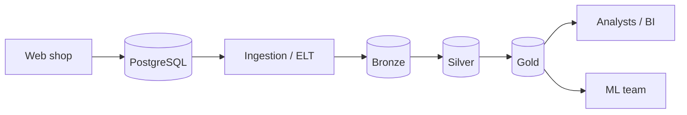

# Architecture

> Update this page at the end of every lesson. It is the diagram you present at
> the oral defence.

## Context

Albert's Marketplace needs a data platform that supports both analysts and the ML team without querying the transactional PostgreSQL database directly.

The platform must provide consistent business metrics, especially for revenue, and prepare datasets such as units sold per product, per country, per day.

It must also handle structured data as well as review text and images, while protecting sensitive information such as saved cards and passwords.

Regarding freshness, the current nightly CSV export means analytical data can be up to one day old. The target platform should support more frequent updates when needed, while keeping the implementation simple enough for the team's skills.

The platform should therefore separate operational and analytical workloads and provide governed data through Bronze, Silver and Gold layers.

## Target architecture

Replace this placeholder with your group's diagram. Name each technology once
your group has chosen it, and link the ADR that chose it.

## Layers

| Layer | What lands here | What it guarantees | Who reads it |
|---|---|---|---|
| Bronze |Raw data extracted from source systems, kept as delivered|Nothing that arrived is lost|Data engineers|
| Silver |Cleaned, deduplicated, typed, and conformed data, with sensitive fields removed |One agreed version of each fact|Data engineers|
| Gold |Business-ready tables and aggregates, such as daily demand by product, country and day|Answers a named business or ML question|Analysts, BI users, ML team|

## Decisions

| ADR | Decision | Status |
|---|---|---|
| [0001](adr/0001-target-architecture.md) | Use a lakehouse architecture with Bronze, Silver and Gold layers |Proposed |

## Change log

| Lesson | What changed |
|---|---|
| L01 | First version |
